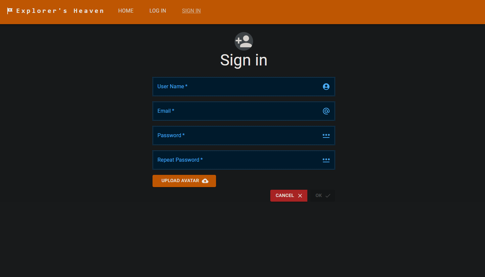

# Explorer's Heaven

## Table of contents

- [Overview](#overview)
- [Installation](#installation)
- [Features](#features)
- [Screenshots](#screenshots)
- [Technologies](#technologies)

## Overview

This project is a Explorer's Heaven platform where users can share and discover amazing places to visit around the world. Whether you're looking for your next adventure or want to share your favorite destinations, Explorer's Heaven is the perfect place to start

## Installation

Navigate to the project directory:

```bash
  cd  Explorer's Heaven
```

Navigate to the api directory:

```bash
  cd  api
```

Install dependencies using npm:

```bash
  npm install
```

Start the development server:

```bash
  npm run dev
```

Navigate to the project directory:

```bash
  cd  Explorer's Heaven
```

Navigate to the client directory:

```bash
  cd  client
```

Install dependencies using npm:

```bash
  npm install
```

Start the development server:

```bash
  npm start
```

Open your browser and visit http://localhost:3000 to view the application.

## Features

- User Authentication: Secure sign-up and login functionality.
- Post Creation: Users can create and edit posts about places worth visiting.
- Post Viewing: Users can browse and read posts created by other users.
- Responsive Design: Optimized for both desktop and mobile devices.
- Image Uploads: Users can upload images to accompany their posts.

## Screenshots

<br>
<br>
<br>
<br>
<br>
<br>
<br>

## Technologies

- React.js
- Typescript
- JavaScript
- Material UI
- React Query
- React Router
- HTML
- CSS
- Express.js
- MongoDB
